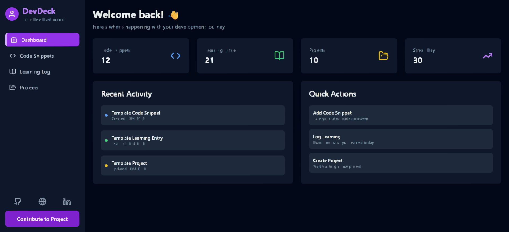

# 🚀 DevDeck

**DevDeck** is a modern, feature-rich developer dashboard built with **React** and **TypeScript**.
It helps developers organize code snippets, track learning progress, and manage projects — all in one place.



---

## ✨ Features

* 📝 **Code Snippets Manager**
  Store and organize frequently used code snippets with **syntax highlighting** and **search** functionality.

* 📚 **Learning Log**
  Track your learning journey, set goals, and maintain notes on new technologies.

* 🎯 **Project Tracker**
  Manage your projects, track progress, and set key milestones.

* 📊 **Dashboard Analytics**
  Visualize your coding activity, learning streaks, and project stats.

* 🌙 **Dark Mode**
  Beautiful dark theme with gradient accents that’s easy on the eyes.

* 🎨 **Modern UI**
  Clean, intuitive interface using the **Montserrat** font and vibrant backgrounds.

* 📱 **Responsive Design**
  Works seamlessly on both desktop and mobile devices.

* 🔄 **Quick Actions**
  Instantly create new snippets, log entries, or projects from anywhere.

---

## 🛠️ Tech Stack

* **Frontend Framework**: React 18 + TypeScript
* **Styling**: Tailwind CSS with custom gradients
* **Build Tool**: Vite for lightning-fast dev experience
* **State Management**: React Hooks & Context API
* **Data Storage**: Local Storage (offline-first support)
* **Icons**: Lucide Icons for clean design consistency
* **Font**: Montserrat for sleek, modern typography

---

## 🚀 Getting Started

### Prerequisites

* Node.js (v16 or higher)
* Package Manager: `npm`, `yarn`, or `bun`

### Installation

1. **Clone the repository**

   ```bash
   git clone https://github.com/YourUsername/DevDeck.git
   ```

2. **Navigate to the project directory**

   ```bash
   cd DevDeck
   ```

3. **Install dependencies**

   ```bash
   # Using bun
   bun install

   # or using npm
   npm install

   # or using yarn
   yarn install
   ```

4. **Start the development server**

   ```bash
   # Using bun
   bun dev

   # or using npm
   npm run dev

   # or using yarn
   yarn dev
   ```

5. **Visit your app**
   Open your browser and go to:
   👉 `http://localhost:8080`

---

## 🤝 Contributing

We welcome contributions of all kinds! Here’s how to get started:

1. Fork the repository
2. Create a new branch

   ```bash
   git checkout -b feature/amazing-feature
   ```
3. Make your changes
4. Run tests and ensure everything works
5. Commit your changes

   ```bash
   git commit -m "Add some amazing feature"
   ```
6. Push to your branch

   ```bash
   git push origin feature/amazing-feature
   ```
7. Open a Pull Request 🚀

### Development Guidelines

* Follow the existing code style and structure
* Write meaningful, clear commit messages
* Document new features appropriately
* Ensure full responsiveness across devices
* Test all changes thoroughly before submitting

---

## 📝 License

This project is licensed under the **MIT License**.
See the [LICENSE](LICENSE) file for more details.

---

## 🙏 Acknowledgments

* [Lucide Icons](https://lucide.dev/) — for the elegant icon pack
* [Tailwind CSS](https://tailwindcss.com/) — utility-first CSS that makes styling a breeze
* [Vite](https://vitejs.dev/) — ultra-fast development build tool
* [React](https://reactjs.org/) — for powering the UI
* [TypeScript](https://www.typescriptlang.org/) — for type safety and scalability

---

## 📧 Contact

Have questions or want to say hello? Reach out:

* **GitHub**: [HumayunK01](https://github.com/HumayunK01)
* **Website**: [DevHumayun](https://devhumayun.vercel.app/)
* **LinkedIn**: [DevHumayun](https://www.linkedin.com/in/devhumayun/)

---

> Made with ❤️ by Humayun Khan